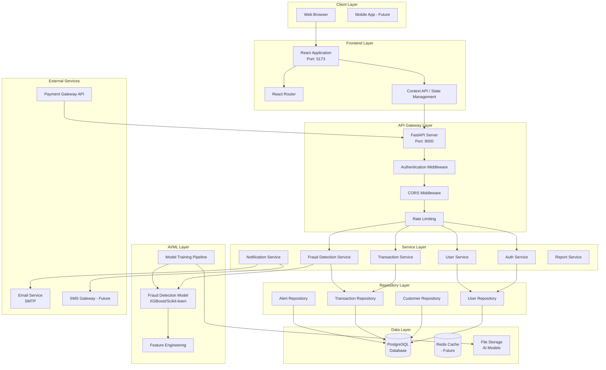
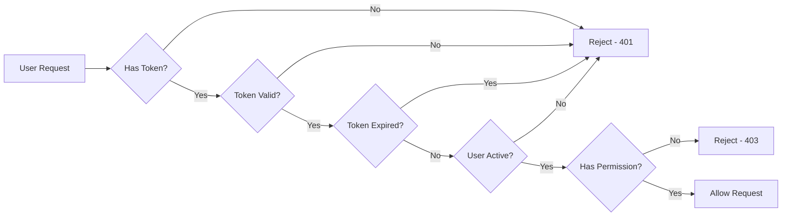

# System Architecture - AI Transaction Scrutinization Engine

## Overview

This document describes the complete system architecture for the AI-Powered Transaction Scrutinization Engine, including frontend, backend, database, and AI components.

---

## High-Level Architecture



---

## Technology Stack

### Frontend
| Component | Technology | Version | Purpose |
|-----------|-----------|---------|---------|
| UI Framework | React | 18.3 | Component-based UI |
| Build Tool | Vite | 5.4 | Fast development server |
| Routing | React Router | 6.30 | Client-side routing |
| HTTP Client | Axios | 1.13 | API communication |
| Styling | TailwindCSS | 3.4 | Utility-first CSS |
| State Management | Context API | Built-in | Global state |
| Charts | Recharts | 2.15 | Data visualization |
| Notifications | React Toastify | 11.0 | Toast messages |
| Icons | Lucide React | 0.263 | Icon library |

### Backend
| Component | Technology | Version | Purpose |
|-----------|-----------|---------|---------|
| Framework | FastAPI | Latest | REST API framework |
| Server | Uvicorn | Latest | ASGI server |
| ORM | SQLAlchemy | Latest | Database ORM |
| Database Driver | psycopg2-binary | Latest | PostgreSQL driver |
| Validation | Pydantic | Latest | Data validation |
| Authentication | python-jose | Latest | JWT tokens |
| Password Hashing | passlib[bcrypt] | Latest | Secure hashing |
| 2FA | pyotp | Latest | TOTP implementation |
| QR Codes | qrcode | Latest | QR code generation |
| ML | scikit-learn | Latest | Machine learning |
| ML | xgboost | Latest | Gradient boosting |
| Data Processing | pandas | Latest | Data manipulation |
| Numerical | numpy | Latest | Numerical operations |

### Database
| Component | Technology | Purpose |
|-----------|-----------|---------|
| Primary DB | PostgreSQL 12+ | Relational data storage |
| Caching | Redis (Future) | Session & query caching |
| File Storage | File System | AI model storage |

### DevOps & Tools
| Component | Technology | Purpose |
|-----------|-----------|---------|
| Version Control | Git | Source control |
| Package Manager (Python) | pip | Dependency management |
| Package Manager (Node) | npm | Dependency management |
| Environment Management | python-venv | Virtual environments |
| API Documentation | Swagger UI | Auto-generated docs |

---

## Architecture Layers

### 1. Presentation Layer (Frontend)

**Responsibilities**:
- User interface rendering
- User input handling
- Client-side validation
- State management
- Routing and navigation
- Session timeout tracking

**Components**:
```
frontend/
├── src/
│   ├── pages/              # Page components
│   │   ├── Login.jsx
│   │   ├── Dashboard.jsx
│   │   ├── Transactions.jsx
│   │   └── ...
│   ├── components/         # Reusable UI components
│   │   ├── Common/
│   │   ├── Layout/
│   │   └── Dashboard/
│   ├── hooks/              # Custom React hooks
│   │   └── useAuth.jsx     # Authentication & session
│   ├── services/           # API services
│   │   └── api.js          # Axios configuration
│   └── App.jsx             # Main app component
```

**Key Features**:
- Component-based architecture
- Reusable UI components
- Custom hooks for logic separation
- Protected route handling
- Session management with auto-logout

---

### 2. API Layer (Backend - FastAPI)

**Responsibilities**:
- HTTP request handling
- Request validation
- Response formatting
- Authentication/Authorization
- CORS handling
- Error handling

**API Structure**:
```
backend/app/routers/
├── auth.py         # Authentication endpoints
├── users.py        # User management
├── admin.py        # Admin operations
└── health.py       # Health check
```

**Endpoint Categories**:

1. **Authentication** (`/auth`)
   - `POST /auth/register` - User registration
   - `POST /auth/login` - User login
   - `GET /auth/me` - Current user info
   - `POST /auth/enable-2fa` - Enable 2FA
   - `POST /auth/verify-2fa` - Verify 2FA code

2. **Users** (`/users`)
   - `GET /users` - List users
   - `GET /users/{id}` - Get user details
   - `PUT /users/{id}` - Update user
   - `DELETE /users/{id}` - Delete user

3. **Admin** (`/admin`)
   - `GET /admin/dashboard` - Dashboard stats
   - `GET /admin/users` - User management
   - `POST /admin/users/{id}/role` - Change user role

4. **Health** (`/health`)
   - `GET /health` - System health check

---

### 3. Service Layer (Business Logic)

**Responsibilities**:
- Business logic implementation
- Data processing
- Transaction coordination
- External service integration
- Fraud detection orchestration

**Services**:

```python
# auth_service.py
class AuthService:
    - register_user()
    - authenticate_user()
    - generate_2fa_secret()
    - verify_2fa_code()
    - create_access_token()
    - reset_password()

# user_service.py
class UserService:
    - get_user_by_id()
    - update_user_profile()
    - change_password()
    - manage_user_roles()

# transaction_service.py (Future)
class TransactionService:
    - process_transaction()
    - get_transaction_history()
    - flag_transaction()
    - approve_transaction()

# fraud_detection_service.py (Future)
class FraudDetectionService:
    - analyze_transaction()
    - calculate_fraud_score()
    - generate_alerts()
    - update_risk_profile()

# notification_service.py
class NotificationService:
    - send_email()
    - send_sms()
    - create_alert()
```

---

### 4. Repository Layer (Data Access)

**Responsibilities**:
- Database operations
- Query building
- Data mapping
- Transaction management

**Pattern**: Repository Pattern

```python
# base_repository.py
class BaseRepository:
    - get_by_id(id)
    - get_all(filters)
    - create(data)
    - update(id, data)
    - delete(id)

# user_repo.py
class UserRepository(BaseRepository):
    - get_by_email(email)
    - get_by_username(username)
    - update_last_login(user_id)
    - enable_2fa(user_id, secret)

# transaction_repo.py
class TransactionRepository(BaseRepository):
    - get_by_customer(customer_id)
    - get_flagged_transactions()
    - get_by_date_range(start, end)
    - update_fraud_score(id, score)
```

---

### 5. Data Layer

**Database Schema**:

```
PostgreSQL Database: AI_POWERED_TRANSACTION_SCRUTINIZATION_ENGINE

Tables:
├── users              # System users (admins, analysts)
├── customers          # Bank customers
├── transactions       # Financial transactions
├── alerts             # Fraud alerts
├── audit_logs         # Audit trail
└── fraud_models       # AI model versions
```

**Connection Management**:
- SQLAlchemy ORM
- Connection pooling
- Automatic session management
- Transaction handling

---

### 6. AI/ML Layer (Future Enhancement)

**Components**:

1. **Feature Engineering**
   - Transaction amount normalization
   - Velocity calculations
   - Geolocation features
   - Device fingerprinting
   - Time-based features

2. **Fraud Detection Model**
   - Algorithm: XGBoost or Random Forest
   - Input: Transaction features
   - Output: Fraud probability (0.0 - 1.0)
   - Training: Supervised learning with labeled data

3. **Model Training Pipeline**
   - Data extraction
   - Feature engineering
   - Train/test split
   - Model training
   - Evaluation (accuracy, precision, recall, F1)
   - Model deployment

4. **Model Versioning**
   - Store model versions in database
   - Track performance metrics
   - Rollback capability

---

## Data Flow

### 1. Authentication Flow

```
User → Frontend → API (/auth/login) → AuthService
                                     ↓
                            Validate Credentials
                                     ↓
                            UserRepository → Database
                                     ↓
                            Generate JWT Token
                                     ↓
                           Store Session Data
                                     ↓
                           Return Token → Frontend
                                     ↓
                            Store in LocalStorage
                                     ↓
                            Redirect to Dashboard
```

### 2. Transaction Processing Flow (Future)

```
Payment Gateway → API (/transactions/analyze)
                        ↓
                TransactionService
                        ↓
              Create Transaction Record
                        ↓
             FraudDetectionService
                        ↓
              Extract Features
                        ↓
              AI Model Prediction
                        ↓
         Fraud Score > 0.7? → YES → Flag Transaction
                ↓                         ↓
               NO                   Create Alert
                ↓                         ↓
          Approve                 Notify Analyst
                ↓
         Return Result → Payment Gateway
```

### 3. Session Management Flow

```
User Login → Create Session Timestamps
              ↓
          lastActivity
          sessionExpiry
              ↓
      User Activity → Update Timestamps
              ↓
     Activity Listeners (mouse, keyboard, scroll)
              ↓
    Every 60 seconds: Check Session
              ↓
  Inactive > 13 min? → YES → Show Warning Modal
              ↓                      ↓
             NO              User Continues/Logs Out
              ↓                      ↓
        Continue          Inactive > 15 min? → Auto Logout
```

---

## Security Architecture

### 1. Authentication & Authorization



### 2. Security Layers

1. **Transport Security**
   - HTTPS/TLS encryption
   - Secure WebSocket (Future)

2. **API Security**
   - JWT token authentication
   - Token expiration (15 minutes)
   - CORS configuration
   - Rate limiting (Future)

3. **Data Security**
   - Password hashing (Bcrypt)
   - SQL injection prevention (ORM)
   - Input validation (Pydantic)
   - XSS prevention

4. **Session Security**
   - 15-minute inactivity timeout
   - No persistent sessions
   - Fresh-start login
   - Activity tracking

5. **Database Security**
   - Encrypted connections
   - Row-level security (Future)
   - Audit logging
   - Backup encryption

---

## Scalability Considerations

### Horizontal Scaling

**API Servers**:
```
            Load Balancer
                 ↓
    ┌────────────┴────────────┐
    ↓            ↓            ↓
FastAPI 1   FastAPI 2   FastAPI 3
    ↓            ↓            ↓
        Database Connection Pool
                 ↓
            PostgreSQL
```

**Benefits**:
- Handle more concurrent requests
- High availability
- Zero-downtime deployments

### Vertical Scaling

**Database**:
- Increase CPU/RAM
- Faster I/O (SSD)
- Connection pooling

**Caching** (Future):
```
Request → Check Redis → Hit? → Return from cache
              ↓
             Miss
              ↓
        Query Database
              ↓
        Cache Result
              ↓
            Return
```

---

## Performance Optimization

### 1. Frontend Optimization
- Code splitting
- Lazy loading
- Memoization (React.memo)
- Virtual scrolling for large lists
- Image optimization
- CDN for static assets (Future)

### 2. Backend Optimization
- Database indexing
- Query optimization
- Connection pooling
- Async/await operations
- Response caching (Future)

### 3. Database Optimization
- Proper indexing strategy
- Query optimization
- Partitioning large tables (Future)
- Materialized views (Future)

**Key Indexes**:
```sql
-- High priority indexes
CREATE INDEX idx_transactions_customer_timestamp 
  ON transactions(customer_id, timestamp);

CREATE INDEX idx_transactions_fraud_score 
  ON transactions(fraud_score) 
  WHERE fraud_score > 0.7;

CREATE INDEX idx_alerts_unresolved 
  ON alerts(is_resolved, assigned_to) 
  WHERE is_resolved = FALSE;
```

---

## Monitoring & Observability (Future)

### Metrics to Track
1. **Application Metrics**
   - Request rate
   - Response time
   - Error rate
   - Active users

2. **Business Metrics**
   - Transactions per day
   - Fraud detection rate
   - False positive rate
   - Average analysis time

3. **System Metrics**
   - CPU usage
   - Memory usage
   - Disk I/O
   - Network traffic

### Logging Strategy
```
Application Logs
    ↓
Log Aggregation (ELK Stack - Future)
    ↓
Centralized Dashboard
```

---

## Deployment Architecture

### Development Environment
```
Developer Machine
├── Backend (localhost:8000)
├── Frontend (localhost:5173)
└── PostgreSQL (localhost:5432)
```

### Production Environment (Future)
```
                Internet
                    ↓
              Reverse Proxy (Nginx)
                    ↓
        ┌───────────┴───────────┐
        ↓                       ↓
    Frontend (Static)      API Server(s)
    S3/CloudFront          Docker Containers
                                ↓
                          Database (RDS)
                                ↓
                         Backup Storage
```

---

## API Documentation

### Auto-Generated Documentation

FastAPI automatically generates:
- **Swagger UI**: `http://localhost:8000/docs`
- **ReDoc**: `http://localhost:8000/redoc`

### API Versioning (Future)
```
/api/v1/auth/login
/api/v1/transactions
/api/v2/transactions  (with breaking changes)
```

---

## Error Handling Architecture

### Error Flow
```
Error Occurs
    ↓
Caught in Service Layer
    ↓
Logged with Context
    ↓
Formatted as HTTP Response
    ↓
{
  "error": "Message",
  "code": "ERROR_CODE",
  "status": 400
}
    ↓
Frontend Displays User-Friendly Message
```

### Error Categories
1. **Validation Errors** (400)
2. **Authentication Errors** (401)
3. **Authorization Errors** (403)
4. **Not Found Errors** (404)
5. **Server Errors** (500)

---

## Testing Strategy (Future)

### Test Pyramid
```
           E2E Tests
         ↗           ↖
    Integration Tests
   ↗                 ↖
Unit Tests
```

1. **Unit Tests**: Test individual functions
2. **Integration Tests**: Test service interactions
3. **E2E Tests**: Test complete user workflows

---

## Disaster Recovery

### Backup Strategy
1. **Database Backups**
   - Full backup: Daily at 2 AM
   - Incremental: Every 6 hours
   - Retention: 30 days

2. **Application Backups**
   - Code repository: Git
   - Configuration: Version controlled
   - AI Models: File storage backup

### Recovery Plan
1. **RTO** (Recovery Time Objective): 2 hours
2. **RPO** (Recovery Point Objective): 6 hours
3. **Failover procedure documented**
4. **Regular recovery drills**

---

## Future Enhancements

### Phase 2
- [ ] Redis caching
- [ ] WebSocket for real-time updates
- [ ] Advanced fraud detection model
- [ ] Comprehensive reporting
- [ ] Email/SMS notifications

### Phase 3
- [ ] Microservices architecture
- [ ] Kubernetes deployment
- [ ] Advanced analytics dashboard
- [ ] Mobile application
- [ ] Third-party integrations

### Phase 4
- [ ] Machine learning model improvements
- [ ] Automated retraining pipeline
- [ ] A/B testing framework
- [ ] Advanced monitoring & alerting
- [ ] Multi-region deployment

---

## Architecture Decision Records (ADRs)

### ADR-001: Use FastAPI for Backend
**Decision**: Use FastAPI instead of Flask or Django  
**Rationale**: Auto documentation, async support, type hints, performance  
**Status**: Accepted

### ADR-002: Use PostgreSQL for Database
**Decision**: Use PostgreSQL instead of MySQL or MongoDB  
**Rationale**: ACID compliance, JSON support, mature ecosystem  
**Status**: Accepted

### ADR-003: Use React for Frontend
**Decision**: Use React instead of Vue or Angular  
**Rationale**: Large ecosystem, component reusability, job market  
**Status**: Accepted

### ADR-004: Use JWT for Authentication
**Decision**: Use JWT tokens instead of session cookies  
**Rationale**: Stateless authentication, scalability, API-friendly  
**Status**: Accepted

### ADR-005: Use Context API for State Management
**Decision**: Use Context API instead of Redux  
**Rationale**: Simpler for medium-sized app, built-in, less boilerplate  
**Status**: Accepted

---

## Conclusion

This architecture provides:
- ✅ **Scalability**: Can handle growth
- ✅ **Maintainability**: Clean separation of concerns
- ✅ **Security**: Multiple security layers
- ✅ **Performance**: Optimized data flow
- ✅ **Reliability**: Error handling and recovery
- ✅ **Extensibility**: Easy to add new features

The system is built with industry best practices and designed for future growth while maintaining simplicity and clarity.
