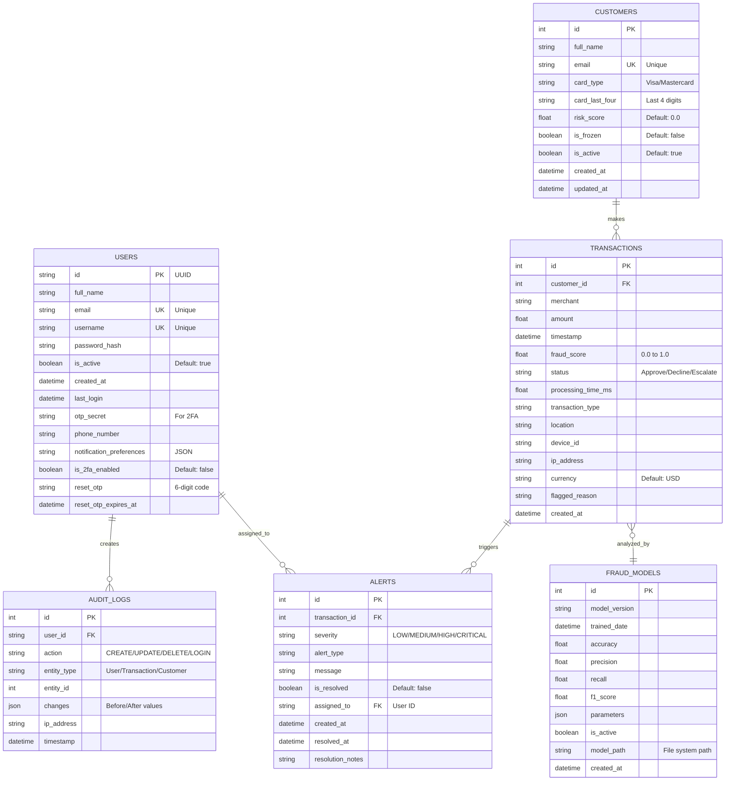

# Entity-Relationship (ER) Diagram - Database Schema

## Overview

This document describes the database schema for the AI-Powered Transaction Scrutinization Engine using PostgreSQL.

---

## ER Diagram



---

## Database Tables Detail

### 1. USERS Table

**Purpose**: Stores system user accounts (admins, fraud analysts, compliance officers)

| Column | Type | Constraints | Description |
|--------|------|------------|-------------|
| id | VARCHAR(36) | PRIMARY KEY | UUID identifier |
| full_name | VARCHAR(255) | NOT NULL | User's full name |
| email | VARCHAR(255) | UNIQUE, NOT NULL | Email address |
| username | VARCHAR(50) | UNIQUE, NOT NULL | Login username |
| password_hash | VARCHAR(255) | NOT NULL | Bcrypt hashed password |
| is_active | BOOLEAN | DEFAULT TRUE | Account status |
| created_at | TIMESTAMP | DEFAULT NOW() | Account creation time |
| last_login | TIMESTAMP | NULL | Last successful login |
| otp_secret | VARCHAR(32) | NULL | TOTP secret for 2FA |
| phone_number | VARCHAR(20) | NULL | Contact number |
| notification_preferences | TEXT | DEFAULT '{}' | JSON preferences |
| is_2fa_enabled | BOOLEAN | DEFAULT FALSE | 2FA status |
| reset_otp | VARCHAR(6) | NULL | Password reset code |
| reset_otp_expires_at | TIMESTAMP | NULL | Reset code expiry |

**Indexes**:
- `idx_users_email` on email
- `idx_users_username` on username
- `idx_users_id` on id (primary)

---

### 2. CUSTOMERS Table

**Purpose**: Stores bank customer information whose transactions are monitored

| Column | Type | Constraints | Description |
|--------|------|------------|-------------|
| id | INTEGER | PRIMARY KEY, AUTO_INCREMENT | Customer ID |
| full_name | VARCHAR(255) | NOT NULL | Customer name |
| email | VARCHAR(255) | UNIQUE | Customer email |
| card_type | VARCHAR(50) | NULL | Visa/Mastercard/Amex |
| card_last_four | VARCHAR(4) | NULL | Last 4 digits of card |
| risk_score | DECIMAL(5,4) | DEFAULT 0.0 | Calculated risk (0.0-1.0) |
| is_frozen | BOOLEAN | DEFAULT FALSE | Account freeze status |
| is_active | BOOLEAN | DEFAULT TRUE | Account active status |
| created_at | TIMESTAMP | DEFAULT NOW() | Account creation |
| updated_at | TIMESTAMP | DEFAULT NOW() | Last update time |

**Indexes**:
- `idx_customers_email` on email
- `idx_customers_risk_score` on risk_score
- `idx_customers_id` on id (primary)

**Business Rules**:
- Risk score recalculated after each transaction
- Customers with risk_score > 0.7 may be auto-frozen

---

### 3. TRANSACTIONS Table

**Purpose**: Stores all financial transactions for fraud analysis

| Column | Type | Constraints | Description |
|--------|------|------------|-------------|
| id | INTEGER | PRIMARY KEY, AUTO_INCREMENT | Transaction ID |
| customer_id | INTEGER | FOREIGN KEY → customers(id) | Customer reference |
| merchant | VARCHAR(255) | NOT NULL | Merchant name |
| amount | DECIMAL(12,2) | NOT NULL | Transaction amount |
| timestamp | TIMESTAMP | DEFAULT NOW() | Transaction time |
| fraud_score | DECIMAL(5,4) | NOT NULL | AI fraud score (0.0-1.0) |
| status | VARCHAR(20) | NOT NULL | Approve/Decline/Escalate |
| processing_time_ms | DECIMAL(8,2) | NULL | Analysis duration |
| transaction_type | VARCHAR(50) | NULL | Purchase/Withdrawal/Transfer |
| location | VARCHAR(255) | NULL | Geographic location |
| device_id | VARCHAR(100) | NULL | Device fingerprint |
| ip_address | VARCHAR(45) | NULL | IP address (IPv4/IPv6) |
| currency | VARCHAR(3) | DEFAULT 'USD' | Currency code |
| flagged_reason | TEXT | NULL | Reason if flagged |
| created_at | TIMESTAMP | DEFAULT NOW() | Record creation time |

**Indexes**:
- `idx_transactions_customer_id` on customer_id
- `idx_transactions_timestamp` on timestamp
- `idx_transactions_fraud_score` on fraud_score
- `idx_transactions_status` on status

**Foreign Keys**:
- `fk_transactions_customer` FOREIGN KEY (customer_id) REFERENCES customers(id) ON DELETE CASCADE

**Business Rules**:
- fraud_score > 0.7 → Auto-flag for review
- fraud_score 0.4-0.7 → Medium risk, monitor
- fraud_score < 0.4 → Approve automatically

---

### 4. ALERTS Table

**Purpose**: Stores fraud alerts for analyst review

| Column | Type | Constraints | Description |
|--------|------|------------|-------------|
| id | INTEGER | PRIMARY KEY, AUTO_INCREMENT | Alert ID |
| transaction_id | INTEGER | FOREIGN KEY → transactions(id) | Related transaction |
| severity | VARCHAR(20) | NOT NULL | LOW/MEDIUM/HIGH/CRITICAL |
| alert_type | VARCHAR(50) | NOT NULL | Fraud type classification |
| message | TEXT | NOT NULL | Alert description |
| is_resolved | BOOLEAN | DEFAULT FALSE | Resolution status |
| assigned_to | VARCHAR(36) | FOREIGN KEY → users(id) | Assigned analyst |
| created_at | TIMESTAMP | DEFAULT NOW() | Alert creation time |
| resolved_at | TIMESTAMP | NULL | Resolution timestamp |
| resolution_notes | TEXT | NULL | Analyst notes |

**Indexes**:
- `idx_alerts_transaction_id` on transaction_id
- `idx_alerts_is_resolved` on is_resolved
- `idx_alerts_severity` on severity
- `idx_alerts_assigned_to` on assigned_to

**Foreign Keys**:
- `fk_alerts_transaction` FOREIGN KEY (transaction_id) REFERENCES transactions(id) ON DELETE CASCADE
- `fk_alerts_user` FOREIGN KEY (assigned_to) REFERENCES users(id) ON DELETE SET NULL

---

### 5. AUDIT_LOGS Table

**Purpose**: Tracks all system actions for compliance and debugging

| Column | Type | Constraints | Description |
|--------|------|------------|-------------|
| id | INTEGER | PRIMARY KEY, AUTO_INCREMENT | Log ID |
| user_id | VARCHAR(36) | FOREIGN KEY → users(id) | User who performed action |
| action | VARCHAR(50) | NOT NULL | CREATE/UPDATE/DELETE/LOGIN |
| entity_type | VARCHAR(50) | NOT NULL | User/Transaction/Customer |
| entity_id | VARCHAR(50) | NULL | ID of affected entity |
| changes | JSON | NULL | Before/after values |
| ip_address | VARCHAR(45) | NULL | User IP address |
| timestamp | TIMESTAMP | DEFAULT NOW() | Action timestamp |

**Indexes**:
- `idx_audit_logs_user_id` on user_id
- `idx_audit_logs_timestamp` on timestamp
- `idx_audit_logs_action` on action

**Foreign Keys**:
- `fk_audit_logs_user` FOREIGN KEY (user_id) REFERENCES users(id) ON DELETE SET NULL

**Retention Policy**: Keep logs for 7 years for compliance

---

### 6. FRAUD_MODELS Table

**Purpose**: Tracks AI model versions and performance

| Column | Type | Constraints | Description |
|--------|------|------------|-------------|
| id | INTEGER | PRIMARY KEY, AUTO_INCREMENT | Model ID |
| model_version | VARCHAR(20) | UNIQUE, NOT NULL | Version number |
| trained_date | TIMESTAMP | NOT NULL | Training completion date |
| accuracy | DECIMAL(5,4) | NOT NULL | Model accuracy score |
| precision | DECIMAL(5,4) | NOT NULL | Precision metric |
| recall | DECIMAL(5,4) | NOT NULL | Recall metric |
| f1_score | DECIMAL(5,4) | NOT NULL | F1 score |
| parameters | JSON | NULL | Model hyperparameters |
| is_active | BOOLEAN | DEFAULT FALSE | Currently deployed |
| model_path | VARCHAR(500) | NOT NULL | File path to model |
| created_at | TIMESTAMP | DEFAULT NOW() | Model creation time |

**Indexes**:
- `idx_fraud_models_version` on model_version
- `idx_fraud_models_is_active` on is_active

**Business Rules**:
- Only one model can have is_active = TRUE at a time
- Model must have accuracy > 0.90 to be deployed

---

## Database Relationships

### One-to-Many Relationships

1. **CUSTOMERS → TRANSACTIONS**
   - One customer can have many transactions
   - `transactions.customer_id` references `customers.id`
   - Cascade delete: If customer deleted, all transactions deleted

2. **USERS → AUDIT_LOGS**
   - One user can create many audit logs
   - `audit_logs.user_id` references `users.id`
   - Set NULL on delete: If user deleted, logs preserved

3. **USERS → ALERTS** (assigned_to)
   - One user can be assigned many alerts
   - `alerts.assigned_to` references `users.id`
   - Set NULL on delete: If user deleted, alerts unassigned

4. **TRANSACTIONS → ALERTS**
   - One transaction can trigger multiple alerts (rare)
   - `alerts.transaction_id` references `transactions.id`
   - Cascade delete: If transaction deleted, alerts deleted

### Many-to-One Relationships

1. **TRANSACTIONS → FRAUD_MODELS**
   - Many transactions analyzed by one active fraud model
   - Relationship tracked via fraud_score metadata

---

## Database Constraints

### Check Constraints

```sql
-- Fraud score must be between 0 and 1
ALTER TABLE transactions 
ADD CONSTRAINT chk_fraud_score 
CHECK (fraud_score >= 0.0 AND fraud_score <= 1.0);

-- Risk score must be between 0 and 1
ALTER TABLE customers 
ADD CONSTRAINT chk_risk_score 
CHECK (risk_score >= 0.0 AND risk_score <= 1.0);

-- Transaction amount must be positive
ALTER TABLE transactions 
ADD CONSTRAINT chk_amount_positive 
CHECK (amount > 0);

-- Status must be valid value
ALTER TABLE transactions 
ADD CONSTRAINT chk_status 
CHECK (status IN ('Approve', 'Decline', 'Escalate', 'Pending'));

-- Severity must be valid value
ALTER TABLE alerts 
ADD CONSTRAINT chk_severity 
CHECK (severity IN ('LOW', 'MEDIUM', 'HIGH', 'CRITICAL'));
```

### Triggers

```sql
-- Update customer.updated_at on any change
CREATE OR REPLACE FUNCTION update_updated_at_column()
RETURNS TRIGGER AS $$
BEGIN
    NEW.updated_at = NOW();
    RETURN NEW;
END;
$$ language 'plpgsql';

CREATE TRIGGER update_customer_modtime
BEFORE UPDATE ON customers
FOR EACH ROW
EXECUTE FUNCTION update_updated_at_column();
```

---

## Sample Queries

### Get high-risk transactions from last 24 hours
```sql
SELECT t.*, c.full_name, c.email
FROM transactions t
JOIN customers c ON t.customer_id = c.id
WHERE t.fraud_score > 0.7
AND t.timestamp > NOW() - INTERVAL '24 hours'
ORDER BY t.fraud_score DESC;
```

### Get unresolved alerts assigned to analyst
```sql
SELECT a.*, t.amount, t.merchant, c.full_name
FROM alerts a
JOIN transactions t ON a.transaction_id = t.id
JOIN customers c ON t.customer_id = c.id
WHERE a.assigned_to = 'user-uuid-here'
AND a.is_resolved = FALSE
ORDER BY a.severity DESC, a.created_at ASC;
```

### Calculate fraud detection statistics
```sql
SELECT 
    COUNT(*) as total_transactions,
    SUM(CASE WHEN fraud_score > 0.7 THEN 1 ELSE 0 END) as flagged_count,
    AVG(fraud_score) as avg_fraud_score,
    AVG(processing_time_ms) as avg_processing_time
FROM transactions
WHERE timestamp > NOW() - INTERVAL '7 days';
```

---

## Data Volume Estimates

| Table | Records/Day | Records/Year | Storage/Year |
|-------|-------------|--------------|--------------|
| transactions | 100,000 | 36.5M | ~15 GB |
| customers | 1,000 new | 365K | ~100 MB |
| alerts | 5,000 | 1.8M | ~500 MB |
| audit_logs | 50,000 | 18M | ~5 GB |
| users | 10 new | 3,650 | ~1 MB |
| fraud_models | 1 new/month | 12 | ~500 MB |

**Total Estimated Storage**: ~21 GB per year

---

## Backup & Recovery Strategy

1. **Full Backup**: Daily at 2 AM
2. **Incremental Backup**: Every 6 hours
3. **Transaction Logs**: Continuous WAL archiving
4. **Retention**: 30 days for daily backups, 1 year for monthly
5. **Recovery Point Objective (RPO)**: 6 hours
6. **Recovery Time Objective (RTO)**: 2 hours

---

## Database Normalization

The schema is in **Third Normal Form (3NF)**:

✅ **1NF**: All attributes are atomic (no multi-valued attributes)
✅ **2NF**: All non-key attributes fully dependent on primary key
✅ **3NF**: No transitive dependencies

**Denormalization Considerations**:
- May add `customer_name` to transactions table for query performance
- May cache `transaction_count` in customers table
- Consider materializing fraud statistics for dashboard

---

## Indexes Strategy

**High Priority** (frequent queries):
- transactions(customer_id, timestamp)
- transactions(fraud_score) WHERE fraud_score > 0.7
- alerts(is_resolved, assigned_to)

**Medium Priority**:
- customers(risk_score)
- audit_logs(timestamp, user_id)

**Low Priority** (rare queries):
- transactions(device_id)
- transactions(ip_address)

---

## Security Considerations

1. **Encryption at Rest**: Enable PostgreSQL encryption
2. **Encryption in Transit**: SSL/TLS for connections
3. **Row-Level Security**: Analysts can only see assigned alerts
4. **Password Hashing**: Bcrypt with cost factor 12
5. **PII Protection**: Email, phone numbers encrypted
6. **Access Control**: Role-based permissions (admin, analyst, viewer)

---

## Future Schema Enhancements

1. Add `fraud_rules` table for configurable rules
2. Add `customer_devices` table for device tracking
3. Add `transaction_features` table for ML features
4. Add `reports` table for stored reports
5. Add `webhooks` table for external integrations
6. Partition `transactions` table by month for performance