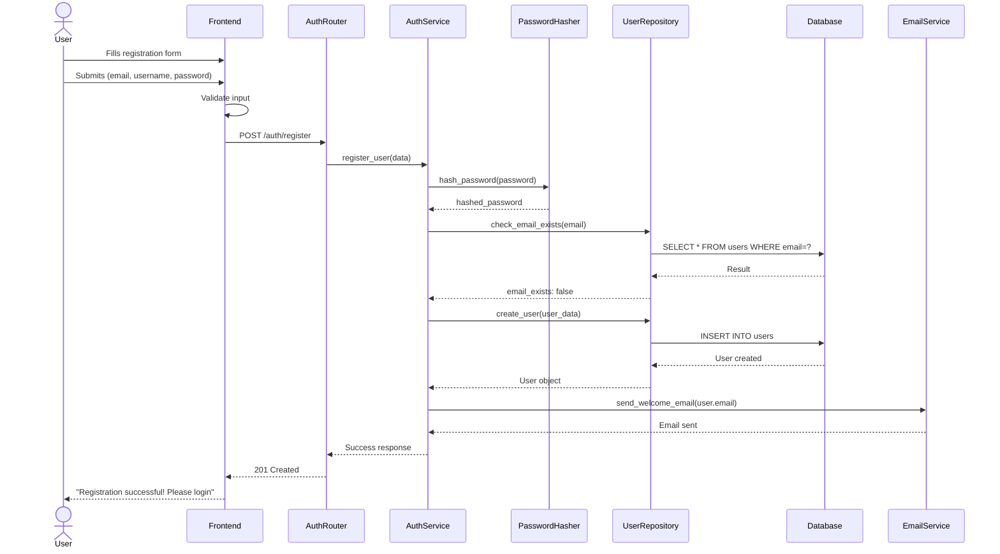
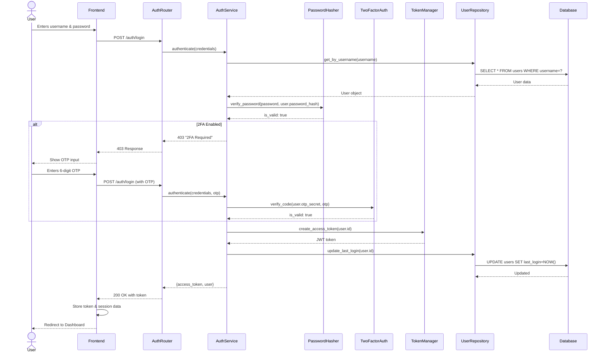
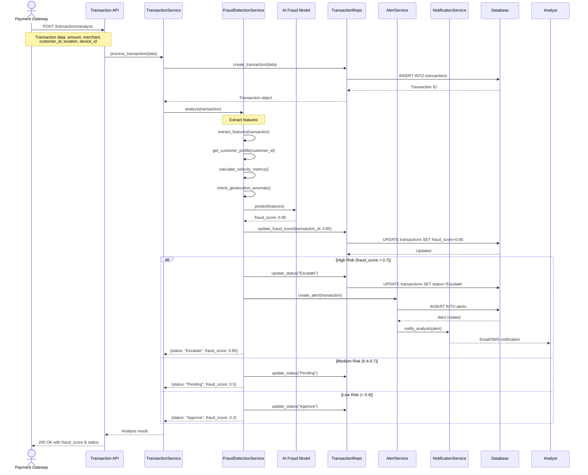
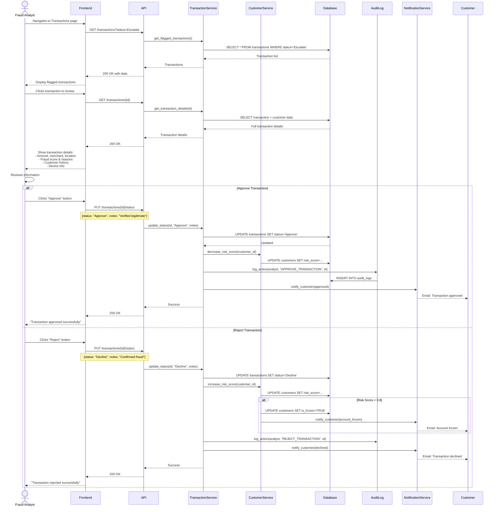
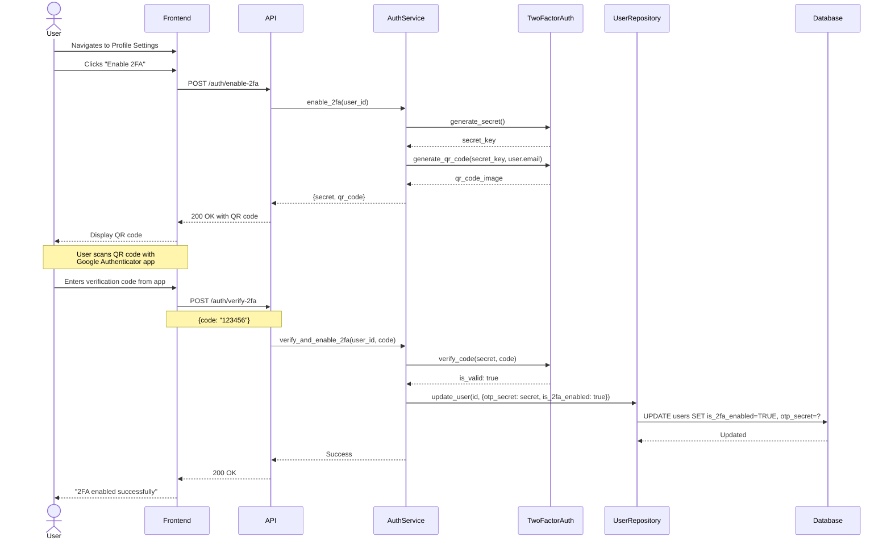
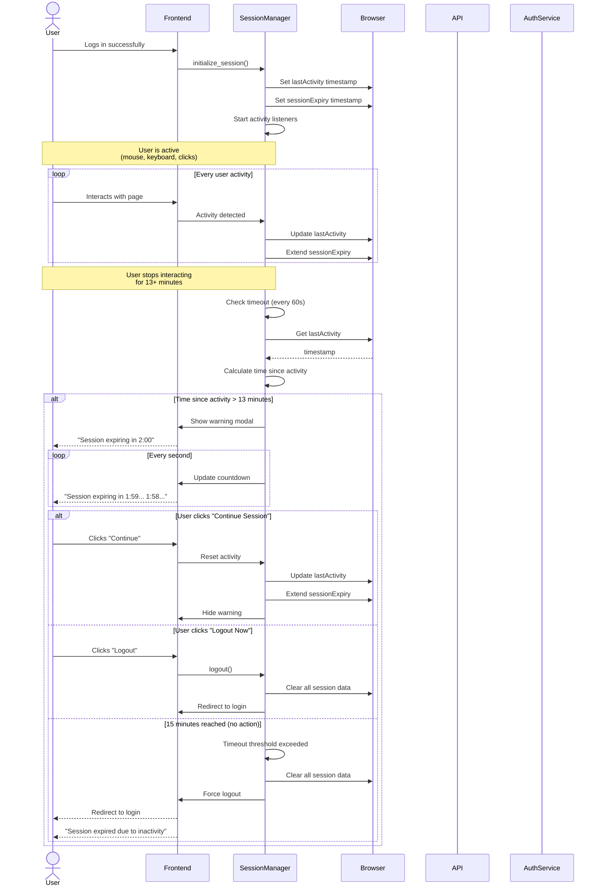
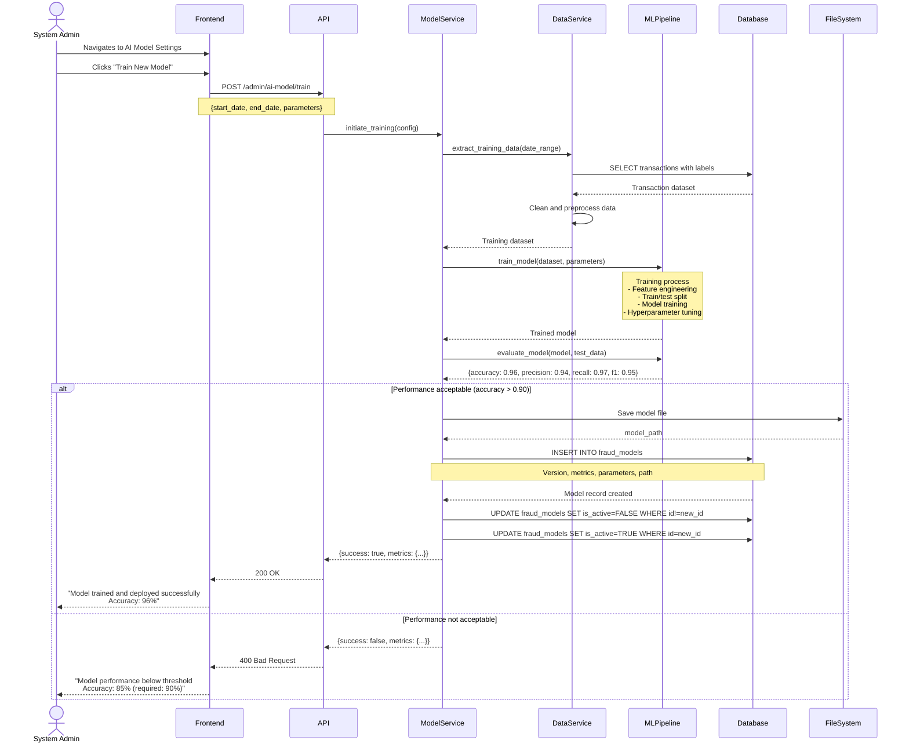
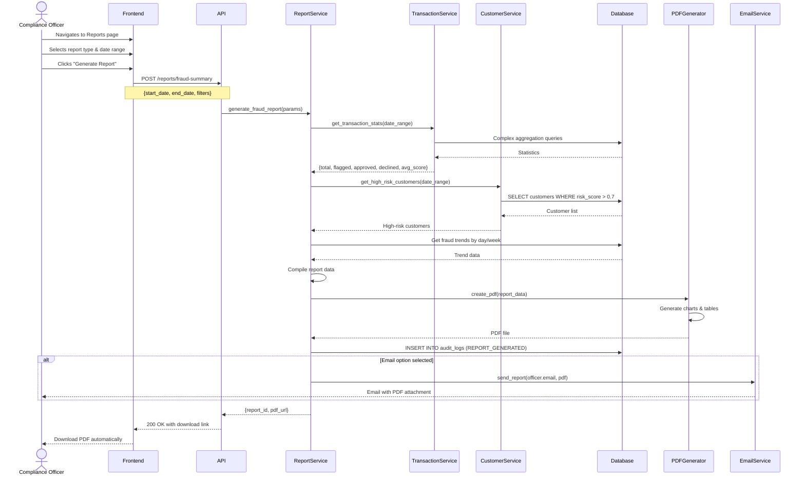
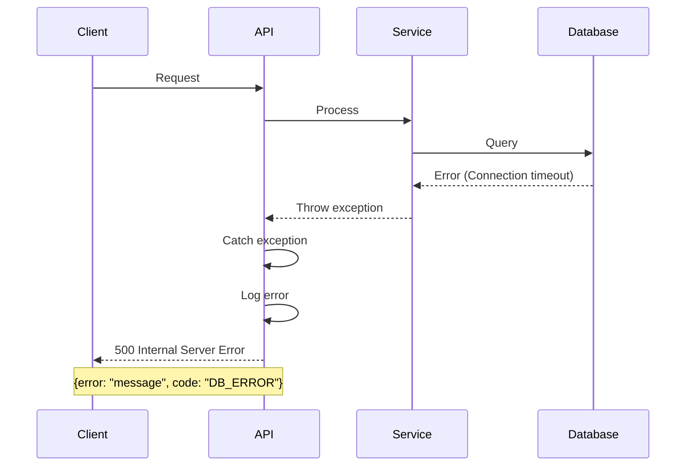

# Sequence Diagrams - AI Transaction Scrutinization Engine

## Overview

This document contains sequence diagrams for key system workflows and user interactions.

---

## 1. User Registration and Login Flow

### 1.1 User Registration

### 1.2 User Login (with 2FA)

---

## 2. Transaction Processing and Fraud Detection

---

## 3. Fraud Analyst Reviews Transaction

---

## 4. Enable Two-Factor Authentication (2FA)

---

## 5. Session Timeout and Auto-Logout

---

## 6. AI Model Training and Deployment

---

## 7. Generate Fraud Report

---

## Key Sequence Flow Patterns

### Authentication Pattern
1. Client sends credentials
2. Server validates
3. Token generated
4. Session initialized
5. Client stores token
6. Subsequent requests include token in Authorization header

### Data Processing Pattern
1. Request received
2. Validation
3. Service layer processing
4. Repository layer database interaction
5. Response formatted
6. Audit logging

### Error Handling Pattern

---

## Performance Considerations

1. **Transaction Analysis**: Must complete in < 200ms
2. **Dashboard Loading**: Should load in < 1 second
3. **Report Generation**: Background job for large reports
4. **Session Check**: Runs every 60 seconds (low overhead)
5. **Database Queries**: Indexed for common access patterns
