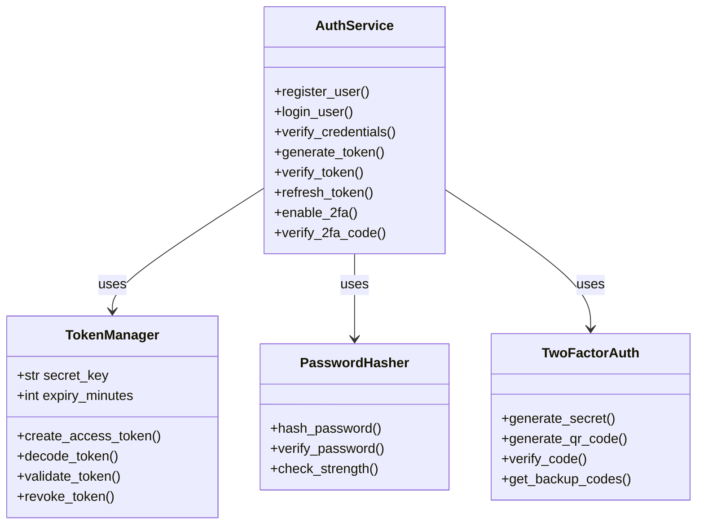
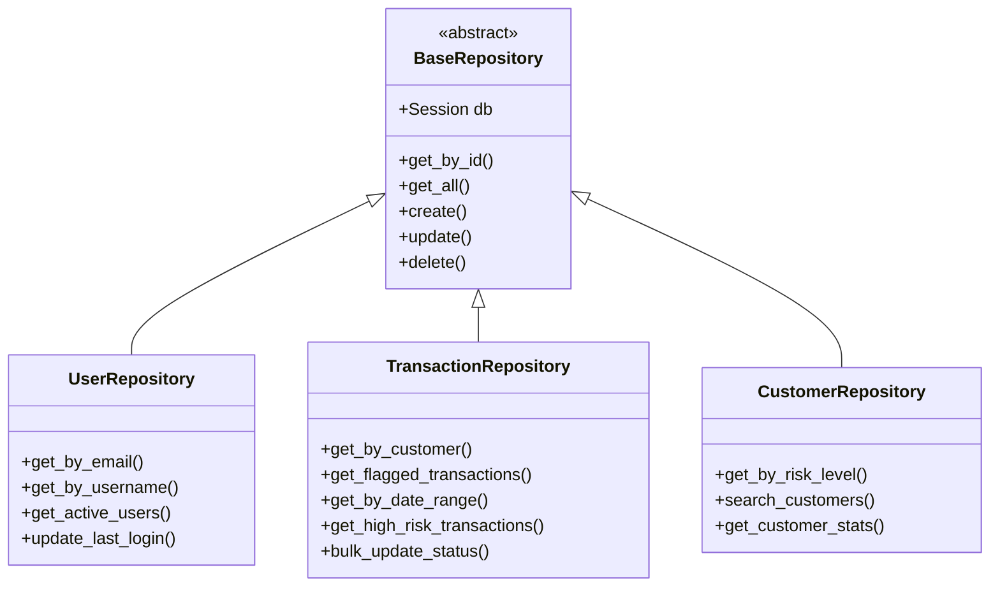
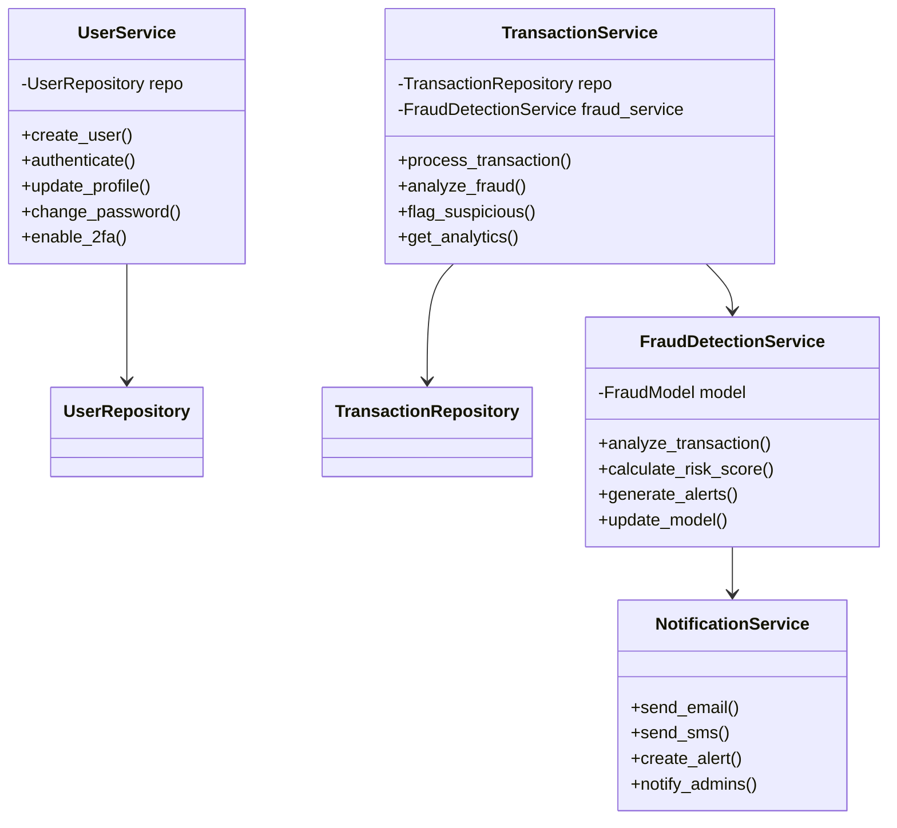
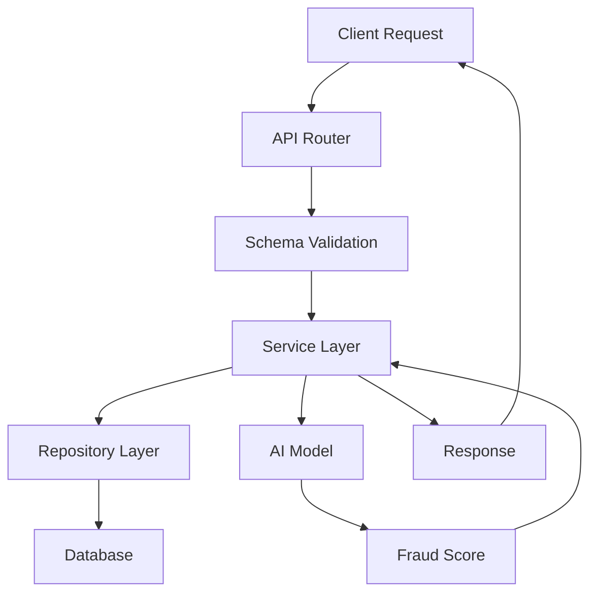

# UML Class Diagram - AI Transaction Scrutinization Engine

## System Overview

This document contains the UML Class Diagrams for the AI-Powered Transaction Scrutinization Engine backend system.

---

## Core Models Class Diagram

```mermaid
classDiagram
    class User {
        +int id
        +str email
        +str username
        +str full_name
        +str hashed_password
        +str role
        +bool is_active
        +bool is_2fa_enabled
        +str totp_secret
        +datetime created_at
        +datetime updated_at
        +datetime last_login
        +login()
        +logout()
        +enable_2fa()
        +verify_2fa()
    }

    class Customer {
        +int customer_id
        +str customer_name
        +str email
        +str phone_number
        +str address
        +str country
        +datetime account_created_date
        +str risk_level
        +datetime last_updated
        +calculate_risk_score()
        +get_transaction_history()
        +update_profile()
    }

    class Transaction {
        +int transaction_id
        +int customer_id
        +datetime transaction_date
        +float amount
        +str transaction_type
        +str merchant_name
        +str location
        +str device_id
        +str ip_address
        +str currency
        +float fraud_score
        +str status
        +str flagged_reason
        +datetime created_at
        +calculate_fraud_score()
        +flag_transaction()
        +approve_transaction()
        +reject_transaction()
    }

    class FraudModel {
        +str model_version
        +datetime trained_date
        +float accuracy
        +dict parameters
        +predict_fraud()
        +retrain()
        +evaluate()
    }

    class AuditLog {
        +int id
        +int user_id
        +str action
        +str entity_type
        +int entity_id
        +dict changes
        +datetime timestamp
        +log_action()
        +get_history()
    }

    class Alert {
        +int alert_id
        +int transaction_id
        +str severity
        +str alert_type
        +str message
        +bool is_resolved
        +int assigned_to
        +datetime created_at
        +datetime resolved_at
        +create_alert()
        +assign_to_user()
        +resolve()
    }

    User "1" -- "*" AuditLog : creates
    Customer "1" -- "*" Transaction : makes
    Transaction "1" -- "0..1" Alert : triggers
    Transaction "*" -- "1" FraudModel : evaluated_by
    Alert "*" -- "0..1" User : assigned_to
```



---

## Authentication & Security Classes



---

## Repository Pattern



---

## Service Layer



---

## API Layer (FastAPI)

```mermaid
classDiagram
    class AuthRouter {
        +POST /auth/register
        +POST /auth/login
        +POST /auth/logout
        +GET /auth/me
        +POST /auth/enable-2fa
        +POST /auth/verify-2fa
    }

    class UserRouter {
        +GET /users
        +GET /users/{id}
        +PUT /users/{id}
        +DELETE /users/{id}
    }

    class TransactionRouter {
        +GET /transactions
        +GET /transactions/{id}
        +POST /transactions/analyze
        +PUT /transactions/{id}/status
    }

    class AdminRouter {
        +GET /admin/dashboard
        +GET /admin/users
        +POST /admin/users/{id}/role
        +GET /admin/alerts
        +GET /admin/statistics
    }

    AuthRouter --> AuthService
    UserRouter --> UserService
    TransactionRouter --> TransactionService
    AdminRouter --> UserService
    AdminRouter --> TransactionService
```

---

## Data Flow Architecture



---

## Key Design Patterns Used

1. **Repository Pattern**: Abstracts data access logic
2. **Service Layer Pattern**: Business logic separation
3. **Dependency Injection**: Through FastAPI's Depends
4. **MVC Pattern**: Models, Views (Routers), Controllers (Services)
5. **Factory Pattern**: Token and password hash generation

---

## Class Relationships Summary

| Class | Relationships |
|-------|---------------|
| User | Has many Audit Logs, Can be assigned Alerts |
| Customer | Has many Transactions |
| Transaction | Belongs to Customer, May have Alert, Analyzed by FraudModel |
| Alert | Belongs to Transaction, Assigned to User |
| FraudModel | Analyzes Transactions |
| Repository Classes | Access Database Models |
| Service Classes | Use Repositories, Implement Business Logic |
| Router Classes | Use Services, Handle HTTP Requests |

---

## Future Enhancements

- Add `Report` class for generating fraud reports
- Add `Rule` class for custom fraud detection rules
- Add `Webhook` class for external integrations
- Add `ApiKey` class for third-party API access
- Add `SessionToken` class for session management
