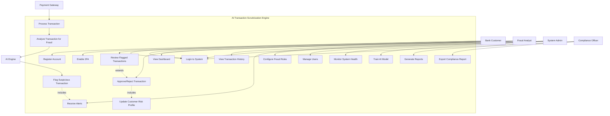

# Use Case Diagram - AI Transaction Scrutinization Engine

## System Actors

### Primary Actors
1. **Bank Customer** - End user whose transactions are monitored
2. **Fraud Analyst** - Analyzes flagged transactions
3. **System Administrator** - Manages system configuration
4. **Compliance Officer** - Reviews fraud reports and compliance
5. **External Payment Gateway** - Third-party payment processor

### Secondary Actors
1. **AI Fraud Detection Engine** - Automated fraud scoring system
2. **Email/Notification Service** - Sends alerts
3. **Database System** - Stores transaction data

---

## Main Use Case Diagram

---

## Detailed Use Cases

### UC1: User Registration

**Actor**: Bank Customer, Fraud Analyst, System Admin

**Precondition**: User has valid email and credentials

**Main Flow**:
1. User navigates to registration page
2. User enters email, username, full name, and password
3. System validates password complexity
4. System creates user account
5. System sends verification email
6. User verifies email
7. Account becomes active

**Postcondition**: User account created and activated

**Alternative Flow**:
- 3a. Password doesn't meet requirements → Show error
- 4a. Email already exists → Show error

---

### UC2: Login to System

**Actor**: All registered users

**Precondition**: User has active account

**Main Flow**:
1. User enters username/email and password
2. System validates credentials
3. If 2FA enabled, system prompts for OTP
4. User enters 6-digit OTP
5. System validates OTP
6. System generates JWT token
7. System creates session with 15-minute timeout
8. User redirected to dashboard

**Postcondition**: User authenticated and session created

**Alternative Flow**:
- 2a. Invalid credentials → Show error
- 5a. Invalid OTP → Show error, allow retry
- Inactivity for 15 minutes → Auto logout

---

### UC3: Enable Two-Factor Authentication

**Actor**: Any authenticated user

**Precondition**: User logged in

**Main Flow**:
1. User navigates to profile settings
2. User clicks "Enable 2FA"
3. System generates TOTP secret
4. System displays QR code
5. User scans QR code with authenticator app
6. User enters verification code
7. System validates code
8. System enables 2FA for account

**Postcondition**: 2FA enabled, required for future logins

---

### UC4: Process Transaction

**Actor**: External Payment Gateway

**Precondition**: Valid transaction data received

**Main Flow**:
1. Gateway sends transaction data via API
2. System validates transaction format
3. System stores transaction in database
4. System triggers fraud analysis (UC5)
5. System returns fraud score to gateway
6. Gateway proceeds or blocks based on score

**Postcondition**: Transaction processed and analyzed

---

### UC5: Analyze Transaction for Fraud

**Actor**: AI Fraud Detection Engine

**Precondition**: Transaction received

**Main Flow**:
1. AI extracts transaction features
2. AI compares to customer's historical behavior
3. AI checks velocity (transactions per time period)
4. AI analyzes geolocation anomalies
5. AI evaluates merchant risk
6. AI calculates fraud probability score (0.0-1.0)
7. If score > threshold, trigger UC6

**Postcondition**: Fraud score assigned to transaction

**Business Rules**:
- Score > 0.7 = High Risk (Auto-flag)
- Score 0.4-0.7 = Medium Risk (Review)
- Score < 0.4 = Low Risk (Approve)

---

### UC6: Flag Suspicious Transaction

**Actor**: AI Engine, Fraud Analyst

**Precondition**: High fraud score detected

**Main Flow**:
1. System marks transaction as "FLAGGED"
2. System creates alert record
3. System assigns alert to fraud analyst
4. System sends notification (UC14)
5. System logs flagging reason

**Postcondition**: Transaction flagged for review

---

### UC7: Review Flagged Transactions

**Actor**: Fraud Analyst

**Precondition**: Analyst logged in with appropriate role

**Main Flow**:
1. Analyst navigates to transactions page
2. System displays flagged transactions
3. Analyst filters by date, risk level, status
4. Analyst selects transaction to review
5. System displays transaction details:
   - Customer profile
   - Transaction amount, location, device
   - Fraud score and reasons
   - Historical patterns
6. Analyst reviews information
7. Analyst decides to approve or reject (UC8)

**Postcondition**: Analyst has reviewed transaction

---

### UC8: Approve/Reject Transaction

**Actor**: Fraud Analyst

**Precondition**: Transaction under review

**Main Flow**:
1. Analyst clicks "Approve" or "Reject"
2. Analyst enters decision notes
3. System updates transaction status
4. System updates customer risk profile (UC17)
5. System logs decision in audit log
6. System sends notification to customer
7. System removes from analyst's queue

**Postcondition**: Transaction status updated

---

### UC9: View Dashboard

**Actor**: Fraud Analyst, Admin

**Precondition**: User authenticated

**Main Flow**:
1. User navigates to dashboard
2. System displays:
   - Total transactions today
   - Flagged transactions count
   - Fraud detection rate
   - Top fraud patterns
   - Recent alerts
   - Live transaction feed
3. Charts update in real-time

**Postcondition**: Dashboard displayed

---

### UC10: Generate Reports

**Actor**: Compliance Officer, Fraud Analyst

**Precondition**: User has reporting permissions

**Main Flow**:
1. User navigates to reports page
2. User selects report type:
   - Fraud summary
   - Customer risk analysis
   - Transaction trends
   - Compliance report
3. User sets date range and filters
4. System queries database
5. System generates report
6. User can export as PDF/CSV
7. System logs report generation

**Postcondition**: Report generated and optionally exported

---

### UC11: Configure Fraud Rules

**Actor**: System Administrator

**Precondition**: Admin authenticated

**Main Flow**:
1. Admin navigates to configuration page
2. Admin sets fraud detection thresholds:
   - Transaction amount limits
   - Velocity rules
   - Geographic restrictions
   - Device fingerprinting rules
3. Admin saves configuration
4. System validates rules
5. System applies new rules to future transactions
6. System logs configuration change

**Postcondition**: Fraud rules updated

---

### UC12: Manage Users

**Actor**: System Administrator

**Precondition**: Admin authenticated

**Main Flow**:
1. Admin navigates to user management
2. Admin can:
   - View all users
   - Create new user
   - Edit user details
   - Change user role (admin, analyst, viewer)
   - Deactivate user
   - Reset user password
3. System validates changes
4. System updates user record
5. System logs admin action

**Postcondition**: User data updated

---

### UC13: View Transaction History

**Actor**: Fraud Analyst, Compliance Officer

**Precondition**: User authenticated

**Main Flow**:
1. User searches for customer
2. System displays customer profile
3. User clicks "Transaction History"
4. System displays all transactions:
   - Date, amount, merchant
   - Fraud score
   - Status (approved/flagged/rejected)
   - Location, device info
5. User can filter and sort
6. User can export history

**Postcondition**: Transaction history displayed

---

### UC14: Receive Alerts

**Actor**: Fraud Analyst

**Precondition**: High-risk transaction detected

**Main Flow**:
1. System creates alert
2. System sends real-time notification:
   - In-app notification badge
   - Email alert
   - Optional SMS (high severity)
3. Analyst receives notification
4. Analyst clicks notification
5. System displays transaction details

**Postcondition**: Analyst notified of suspicious activity

---

### UC15: Monitor System Health

**Actor**: System Administrator

**Precondition**: Admin authenticated

**Main Flow**:
1. Admin navigates to system health page
2. System displays:
   - API response times
   - Database connection status
   - AI model performance metrics
   - Error logs
   - Server resource usage
3. Admin can view detailed logs
4. Admin can restart services if needed

**Postcondition**: System health monitored

---

### UC16: Train AI Model

**Actor**: System Administrator, Data Scientist

**Precondition**: Sufficient training data available

**Main Flow**:
1. Admin navigates to AI model settings
2. Admin selects training data date range
3. System exports labeled transactions
4. Admin initiates model training
5. System trains model with new data
6. System evaluates model accuracy
7. If accuracy improved, deploy new model
8. System logs model version

**Postcondition**: AI model updated

---

### UC17: Update Customer Risk Profile

**Actor**: System (automated)

**Precondition**: Transaction decision made

**Main Flow**:
1. System analyzes transaction outcome
2. If transaction rejected → Increase risk score
3. If transaction approved → Maintain/decrease risk score
4. System updates customer risk level:
   - LOW, MEDIUM, HIGH
5. System adjusts future fraud thresholds for customer

**Postcondition**: Customer risk profile updated

---

### UC18: Export Compliance Report

**Actor**: Compliance Officer

**Precondition**: User has compliance role

**Main Flow**:
1. Officer navigates to compliance reports
2. Officer selects report period (monthly/quarterly)
3. System generates report including:
   - Total transactions processed
   - Fraud detected and prevented
   - False positive rate
   - Regulatory flagged transactions
   - Customer complaints
4. System generates PDF with digital signature
5. Officer downloads report
6. System archives report for audit

**Postcondition**: Compliance report generated

---

## Use Case Relationships

### Includes Relationships
- **UC4 (Process Transaction)** includes **UC5 (Analyze Transaction)**
- **UC6 (Flag Transaction)** includes **UC14 (Receive Alerts)**
- **UC8 (Approve/Reject)** includes **UC17 (Update Risk Profile)**

### Extends Relationships
- **UC7 (Review Transaction)** extends to **UC8 (Approve/Reject)**
- **UC3 (Enable 2FA)** extends **UC2 (Login)** for enhanced security

### Generalization
- **UC10 (Generate Reports)** has specialized versions:
  - Generate Fraud Report
  - Generate Compliance Report
  - Generate Customer Risk Report

---

## Non-Functional Requirements

1. **Performance**:
   - Fraud analysis < 200ms
   - API response time < 500ms
   - Support 1000+ concurrent transactions

2. **Security**:
   - JWT token-based authentication
   - 15-minute session timeout
   - Password complexity requirements
   - Optional 2FA
   - HTTPS encryption

3. **Availability**:
   - 99.9% uptime
   - Auto-recovery from failures
   - Database backup every 6 hours

4. **Scalability**:
   - Horizontal scaling for API servers
   - Database connection pooling
   - Redis caching for frequent queries

---

## System Boundaries

**Inside System Scope**:
- User authentication and authorization
- Transaction processing and analysis
- Fraud detection and scoring
- Alert management
- Reporting and analytics
- System configuration

**Outside System Scope**:
- Payment processing (handled by external gateway)
- Customer onboarding (handled by bank)
- SMS/Email delivery (third-party service)
- Bank core banking system

---

## Success Metrics

1. **Fraud Detection Rate**: > 95% of fraudulent transactions caught
2. **False Positive Rate**: < 5% of legitimate transactions flagged
3. **Response Time**: Transaction analysis < 200ms
4. **User Adoption**: > 90% fraud analysts using system daily
5. **System Uptime**: 99.9% availability